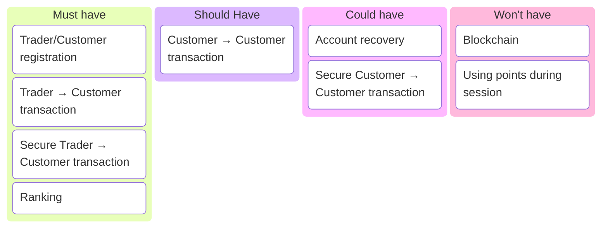
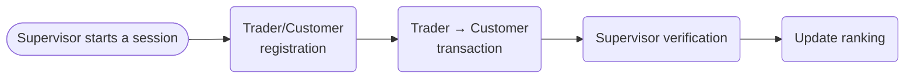
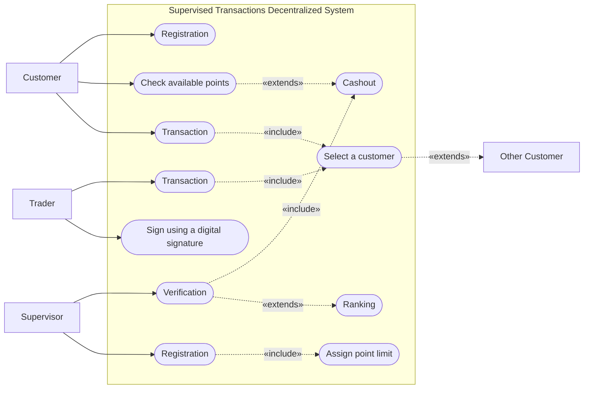
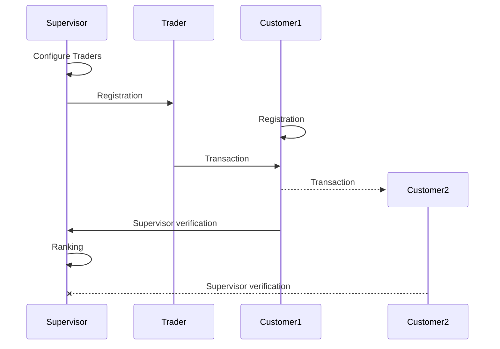

## MoSCoW

## Low fidelity mockup

[Figma](https://www.figma.com/proto/TIDiPSxJoRu6MWFVle7tm1/Untitled--Copy-?node-id=2-1892&p=f&t=DvmJ1cJBPvy8EBzg-1&scaling=contain&content-scaling=fixed&page-id=0%3A1&starting-point-node-id=2%3A1892&show-proto-sidebar=1)

## Flowchart

## Use Case Diagram

## Sequence Diagram

